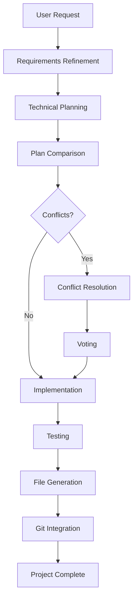

# System Architecture Overview

## 🎯 Design Philosophy

The AI Orchestration System was designed with the following core principles:

### **Python Modular Architecture Over Microservices**

After careful consideration of both Node.js microservices and Python modular approaches, we chose **Python modular architecture** for the following reasons:

1. **AI-Native Ecosystem**: Python's rich AI/ML libraries and tools
2. **Simplicity Over Complexity**: Single application vs. distributed system complexity
3. **Shared State Management**: Multi-agent coordination benefits from shared memory
4. **Development Velocity**: Faster iteration and debugging in monolithic structure
5. **Operational Simplicity**: Single deployment unit, unified logging and monitoring

## 🏗️ High-Level Architecture

```
┌─────────────────────────────────────────────────────────────┐
│                    AI Orchestration System                   │
├─────────────────────────────────────────────────────────────┤
│  Web Interface (FastAPI)     │  CLI Interface               │
├─────────────────────────────────────────────────────────────┤
│                Core Orchestrator                            │
│  ┌─────────────────┐  ┌─────────────────┐  ┌─────────────┐  │
│  │  Workflow       │  │  State          │  │  Task       │  │
│  │  Engine         │  │  Manager        │  │  Scheduler  │  │
│  └─────────────────┘  └─────────────────┘  └─────────────┘  │
├─────────────────────────────────────────────────────────────┤
│                   AI Agents Layer                           │
│  ┌─────────────┐  ┌─────────────┐  ┌─────────────────────┐  │
│  │   GPT-4     │  │   Claude    │  │      Gemini         │  │
│  │ (Project    │  │ (Backend    │  │   (Frontend         │  │
│  │  Manager)   │  │  Expert)    │  │    Expert)          │  │
│  └─────────────┘  └─────────────┘  └─────────────────────┘  │
├─────────────────────────────────────────────────────────────┤
│                 Infrastructure Layer                        │
│  ┌─────────────┐  ┌─────────────┐  ┌─────────────────────┐  │
│  │   Logging   │  │    File     │  │       Git           │  │
│  │ & Metrics   │  │  Manager    │  │   Integration       │  │
│  └─────────────┘  └─────────────┘  └─────────────────────┘  │
└─────────────────────────────────────────────────────────────┘
```

## 🧩 Core Components

### 1. **Web Interface Layer**
- **FastAPI Application**: Modern, fast web framework
- **Real-time Dashboard**: WebSocket-based live updates
- **REST API**: Complete CRUD operations for projects
- **Static Assets**: Bootstrap-based responsive UI

### 2. **Core Orchestrator**
- **AIOrchestrator**: Main coordination engine
- **WorkflowEngine**: YAML-based workflow execution
- **StateManager**: Session and workflow state management
- **TaskScheduler**: Parallel and sequential task coordination

### 3. **AI Agents Layer**
- **BaseAgent**: Abstract class with retry logic and error handling
- **GPTAgent**: OpenAI integration for project management
- **ClaudeAgent**: Anthropic integration for backend development
- **GeminiAgent**: Google integration for frontend development

### 4. **Infrastructure Layer**
- **Logging & Metrics**: Structured logging with performance monitoring
- **File Manager**: Code generation and project structure creation
- **Git Integration**: Repository management and GitHub publishing

## 🔄 Multi-Agent Workflow

### Phase-Based Execution



### Agent Responsibilities

| Agent | Role | Primary Tasks |
|-------|------|--------------|
| **GPT-4** | Project Manager | Requirements refinement, plan comparison, conflict resolution, test generation |
| **Claude** | Backend Expert | Backend architecture, API design, database modeling, server implementation |
| **Gemini** | Frontend Expert | UI/UX design, frontend architecture, component development, user experience |

## 🔧 Technology Stack

### **Core Technologies**
- **Python 3.11+**: Modern Python with type hints
- **FastAPI**: High-performance web framework
- **Pydantic**: Data validation and settings management
- **HTTPX**: Async HTTP client for AI APIs
- **Tenacity**: Retry logic and resilience
- **YAML**: Workflow configuration

### **AI Service Integration**
- **OpenAI API**: GPT-4 for project management
- **Anthropic API**: Claude for backend development
- **Google Gemini API**: Advanced frontend capabilities

### **Infrastructure**
- **Docker**: Containerization and deployment
- **Redis**: Caching and session management
- **PostgreSQL**: Optional persistent storage
- **Git/GitHub**: Version control and publishing

### **Frontend Technologies**
- **Bootstrap 5**: Responsive UI framework
- **Chart.js**: Data visualization
- **WebSockets**: Real-time updates
- **Font Awesome**: Icons and graphics

## 📊 Data Flow Architecture

### Request Processing Flow

1. **Input Layer**: Web UI or CLI receives user request
2. **Validation Layer**: Configuration and API key validation
3. **Orchestration Layer**: Workflow engine coordinates execution
4. **Agent Layer**: AI models process tasks independently
5. **Integration Layer**: Results combined and conflicts resolved
6. **Output Layer**: Files generated and projects created
7. **Storage Layer**: Results saved and optionally published

### State Management

```python
@dataclass
class WorkflowState:
    session_id: str
    current_phase: WorkflowPhase
    user_request: str
    refined_requirements: Optional[str]
    claude_plan: Optional[str]
    gemini_plan: Optional[str]
    disagreements: List[Dict[str, Any]]
    votes: Dict[str, Any]
    final_decision: Optional[str]
    backend_implementation: Optional[str]
    frontend_implementation: Optional[str]
    test_implementation: Optional[str]
    execution_log: List[Dict[str, Any]]
```

## 🔒 Security Architecture

### API Security
- **Environment-based secrets**: API keys stored in environment variables
- **Request validation**: All inputs validated with Pydantic
- **Rate limiting**: Per-service rate limiting with exponential backoff
- **Error sanitization**: Sensitive information removed from logs

### Infrastructure Security
- **Non-root containers**: Docker containers run as non-privileged users
- **Network isolation**: Services communicate through defined interfaces
- **Health checks**: Regular monitoring of service availability
- **Audit logging**: All actions logged for security monitoring

## 📈 Scalability Considerations

### Horizontal Scaling
- **Stateless design**: Core components can be replicated
- **External state storage**: Redis for sessions, PostgreSQL for persistence
- **Load balancing**: Multiple instances behind reverse proxy
- **Agent isolation**: Independent scaling of AI service calls

### Performance Optimization
- **Async operations**: Non-blocking I/O throughout the system
- **Connection pooling**: Reused connections to AI services
- **Caching**: Response caching for repeated operations
- **Lazy loading**: Components loaded on demand

## 🚨 Error Handling Strategy

### Multi-Layer Error Handling
1. **Network Layer**: Connection timeouts and retries
2. **API Layer**: Service-specific error handling
3. **Application Layer**: Business logic error recovery
4. **User Layer**: Graceful error presentation

### Resilience Patterns
- **Circuit Breaker**: Prevent cascading failures
- **Retry with Backoff**: Exponential retry strategies
- **Graceful Degradation**: Continue with reduced functionality
- **Fallback Services**: Alternative AI models when primary fails

This architecture provides a robust, scalable, and maintainable foundation for multi-agent AI orchestration while keeping operational complexity manageable.