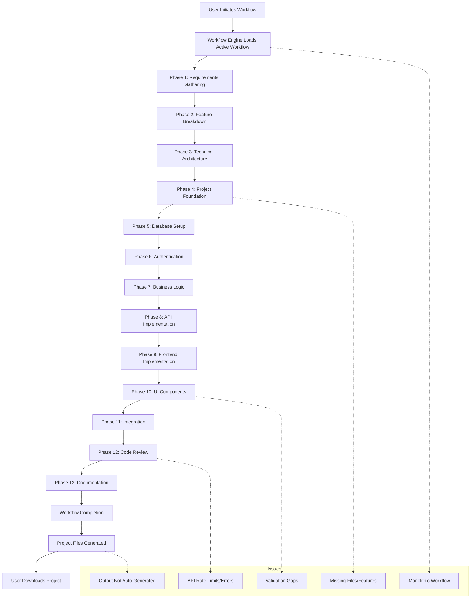

# AI Orchestrator Project Workflow Report

## Overview

This report details the workflow implemented in the AI Orchestrator project, describes how the application operates, presents a flowchart of the workflow, and summarizes the problems encountered during testing and current issues.

---

## 1. Workflow Structure & App Behavior

The AI Orchestrator is designed to automate the generation of full-stack projects using a multi-phase workflow. The workflow is defined in YAML files (e.g., `default.yaml`, `feature-based.yaml`) and executed by the workflow engine. The app supports both CLI and web interfaces.

### Workflow Phases (Feature-Based Example)
1. **Requirements Gathering**: Collects and clarifies project requirements.
2. **Feature Breakdown**: Decomposes requirements into granular features.
3. **Technical Architecture**: Designs the system architecture.
4. **Project Foundation**: Sets up the initial project structure.
5. **Database Setup**: Implements database models and migrations.
6. **Authentication**: Adds user authentication and authorization.
7. **Business Logic**: Implements core business features.
8. **API Implementation**: Develops backend API endpoints.
9. **Frontend Implementation**: Builds the frontend application.
10. **UI Components**: Creates reusable UI components.
11. **Integration**: Integrates frontend and backend.
12. **Code Review**: Reviews and validates the codebase.
13. **Documentation**: Generates project documentation.
14. **Workflow Completion**: Finalizes the project and generates output files.

### App Behavior
- The user initiates a workflow via the web or CLI interface.
- The workflow engine loads the active workflow configuration (`active.yaml`).
- Each phase is executed in sequence, with validation and output at each step.
- Upon successful completion, the app generates the project files for download.

---

## 2. Workflow Flowchart

---

## 3. Problems Faced During Testing

### a. Initial Issues
- **Port Conflict**: The web app failed to start due to port 8000 being in use.
- **Workflow Stuck**: The workflow would get stuck, especially at the code review phase.
- **API Errors**: Encountered 400/429 errors from OpenAI, causing workflow failures.

### b. Output Generation Issues
- **No Output Files**: Project files were not generated automatically after workflow completion; they were only created when the `/download` endpoint was called.
- **Fix**: Modified the orchestrator to auto-generate project files upon successful workflow completion.

### c. Project Quality Issues
- **Frontend/Backend Mismatch**: Generated frontend expected React, but backend code was for NestJS.
- **Missing Files**: Essential files like `main.py` (backend) and React structure were missing.
- **Missing Dependencies**: Required packages (e.g., `asyncpg`) were not included.
- **Incomplete Features**: Only basic CRUD was present; core features (auth, analytics, etc.) were missing.

### d. Root Causes Identified
- **Monolithic Workflow**: The original workflow was too broad, lacking granularity.
- **Validation Gaps**: No enforcement of required files, features, or architecture.
- **Lack of Intermediate Validation**: Errors were only caught at the end, not during each phase.

---

## 4. Solutions Implemented

- **Feature-Based Workflow**: Created a granular, phase-based workflow (`feature-based.yaml`) with validation at each step.
- **Advanced Validation**: Updated the workflow engine to check for required files, features, endpoints, and components.
- **Auto Output Generation**: Ensured project files are generated automatically after workflow completion.
- **Workflow Switching**: Added a script to easily switch between workflows.

---

## 5. Current Issues

- **Validation Coverage**: Further improvements needed to ensure all required features and files are present.
- **API Rate Limits**: Still susceptible to external API rate limits (e.g., OpenAI).
- **Feature Completeness**: Generated projects may still lack some advanced features or polish.

---

## 6. Recommendations

- Continue refining validation logic for each workflow phase.
- Add more granular error handling and user feedback.
- Consider caching or batching API calls to avoid rate limits.
- Expand test coverage for generated projects.

---

**End of Report** 